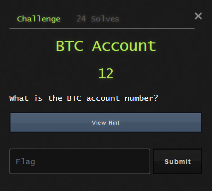

***

## AFRICA DFIR CTF

>  First Digital Forensics Competition in Africa 

***
## Challenge : BTC ACCOUNT (Week 3)


Cette question si innocente a été le supplice de plusieurs professionnels de la cybersécurité durant cette compétition.
Certains se sont même demandé si le [@bjCSIRT](https://twitter.com/bjCSIRT/) détenait les **super-ordinateurs** du Bénin 😅. 
***

***
**Ironie du sort, saviez-vous qu'aucune instance du logiciel hashcat n'a été lancé pour la résolution du challenge ?** Plus simplement, on a pu accéder au contenu du ZIP sans avoir eu recours au cracking .. Haha 😂😂😂 , rassurez-vous c'est pas de la *magie noire* .. C'est de la magie **VANTABLACK** 🔥 ! Trêve de bavardage, passont aux choses sérieuses :)


Ce challenge a en particulier mis en lumière un fichier ZIP [accountNum.zip](Images/accountNum.zip) qui avait autrefois été mentionné dans une précédente épreuve (**Finding Filenames : Week 2**). Ci-dessous la chronologie des actions faisant intervenir ce fameux fichier : 

1. Téléchargement du fichier **accountNum.zip** depuis un serveur FTP.
```console
220 Welcome to Hacker FTP service.
AUTH TLS
530 Please login with USER and PASS.
AUTH SSL
530 Please login with USER and PASS.
USER kali
331 Please specify the password.
PASS AfricaCTF2021
230 Login successful.
CWD /home/kali/Documents
250 Directory successfully changed.
TYPE I
200 Switching to Binary mode.
PASV
227 Entering Passive Mode (192,168,1,20,247,209).
RETR accountNum.zip
150 Opening BINARY mode data connection for accountNum.zip (239 bytes).
226 Transfer complete.
```
2. Ouverture du fichier via **7-zip** et lecture du contenu avec le logiciel Notepad.
```console
"C:\Windows\system32\NOTEPAD.EXE" C:\Users\JOHNDO~1\AppData\Local\Temp\7zO4FB31F24\accountNum
```
3. Suppression définitive du fichier ZIP et du contenu extrait.
```console
sdelete .\accountNum
sdelete .\accountNum.zip
```

**NB:** Il est important de noter que lors du dump de la RAM, le programme Notepad apparaît comme un processus en exécution.

```powershell
2520    2152    notepad.exe     0xbf0f6d8450c0  1       -       1       False   2021-04-30 17:44:28.000000      N/A     Disabled
```

## Conclusion : 
Au regard de la chronologie des évènements, il serait possible d'accéder au contenu du fichier extrait en fouillant dans la mémoire du programme Notepad.

```console
charliepy@charliepy:~/Hacker/Tools/volatility$ python vol.py -f 20210430-Win10Home-20H2-64bit-memdump.mem --profile=Win10x64_19041 memdump -p 2520 -D .
charliepy@charliepy:~/Hacker/Tools/volatility$ xxd 2520.dmp | grep -A 10 -B 10 "B.T.C"
004cc380: 0000 0000 0000 0000 0000 0000 0000 0000  ................
004cc390: 0000 0000 0000 0000 0000 0000 0000 0000  ................
004cc3a0: 0000 0000 0000 0000 0000 0000 0000 0000  ................
004cc3b0: 0000 0000 0000 0000 0000 0000 0000 0000  ................
004cc3c0: 0000 0000 0000 0000 0000 0000 0000 0000  ................
004cc3d0: 0000 0000 0000 0000 0000 0000 0000 0000  ................
004cc3e0: 0000 0000 0000 0000 0000 0000 0000 0000  ................
004cc3f0: 0000 0000 0000 0000 0000 0000 0000 0000  ................
004cc400: 0000 0000 0000 0000 0000 0000 0000 0000  ................
004cc410: 0000 0000 0000 0000 0000 0000 0000 0000  ................
004cc420: 4200 5400 4300 2000 3800 3300 3200 3900  B.T.C. .8.3.2.9.
004cc430: 3400 3800 3100 3900 3100 3000 3900 3400  4.8.1.9.1.0.9.4.
004cc440: 3900 3900 3000 3300 3200 3800 3400 3300  9.9.0.3.2.8.4.3.
004cc450: 3800 3200 3800 3000 3100 3200 3900 3000  8.2.8.0.1.2.9.0.
004cc460: 3300 3400 3900 3000 3500 3400 3800 3000  3.4.9.0.5.4.8.0.
004cc470: 3200 3300 3100 0d00 0000 0000 0000 0000  2.3.1...........
004cc480: 0000 0000 0000 0000 0000 0000 0000 0000  ................
004cc490: 0000 0000 0000 0000 0000 0000 0000 0000  ................
004cc4a0: 0000 0000 0000 0000 0000 0000 0000 0000  ................
004cc4b0: 0000 0000 0000 0000 0000 0000 0000 0000  ................
004cc4c0: 0000 0000 0000 0000 0000 0000 0000 0000  ................
```

Magnifique ou bien ? C'était aussi simple que ça ;)

**Flag** : 832948191094990328438280129034905480231
