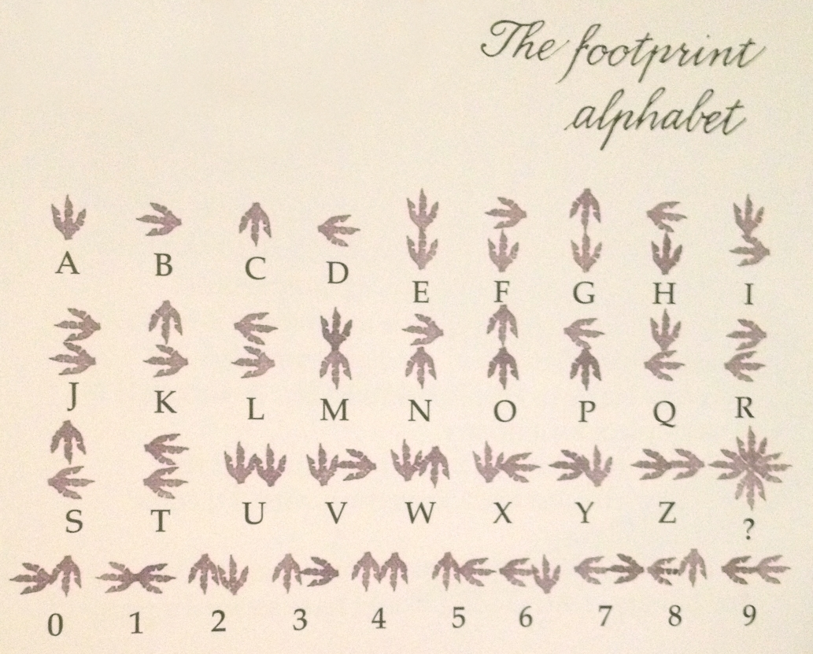

* * *
# Ancient langage 
> (Crypto, 300 points )
---
## Challenge :
> C'est un language connu des ancêtres des cyber-amazones. [ [chal.png](Images/chal.png ) ]

L’image ```chal.png``` contient des symboles qui font référence au ```footprint alphabet```.



Après dechiffrement, nous obtenons le ```flag```.

```Flag ```: **CTF_RESPECT**
