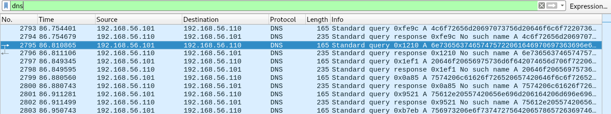

* * *
# Covert Channel
> (Forensic, 200 points )
---
## Challenge :
> Le gayeman DJAKPAGLO est maintenant aux mains de l'OCRC. Mais Il semble que DJAKPATAGLO ait des espions au sein du bjCSIRT. Ces derniers arrivent à contourner les mesures de sécurité mises en place pour exfiltrer des données vers leur chef en prison. Le SOC du bjCSIRT a répéré cela à travers une capture réseau, qu'il vous envoie pour analyse. [ [capture.zip](File/capture.zip ) ]

Après extraction du fichier du challenge, on obtient un fichier [ [capture.pcap](File/capture.pcap) ]. Ouvrons-le avec ```wireshark```, puis rendons-nous dans l'onglet :
> Statisques > Hiérarchie des protocoles 


On aperçoit sur l'image des statistiques, ```32``` paquets ```DNS``` et ```804``` paquets ```HTTP```. En fouillant du côté des paquets ```HTTP```, on ne trouva aucune piste pouvant nous aider à retrouver le ```flag```. En fouillant du côté des paquets ```DNS```, on repéra des tentatives de résolutions d'adresses au format ```hexadécimal``` qui ont échouées.


Essayons maintenant d'extraire toutes les requêtes **DNS** se trouvant dans le fichier [ [capture.pcap](File/capture.pcap) ]. Pour le faire, on utilisera l'utilitaire en ligne de commande de ```wireshark``` qui est bien évidemment le célèbre ```tsark```.

```console
root@Y3HW3_Hack3r:~/HackerLab2019# tshark -r capture.pcap -T fields -e dns.qry.name  > allDnsQuery.txt
root@Y3HW3_Hack3r:~/HackerLab2019# strings allDnsQuery.txt
4c6f72656d20697073756d20646f6c6f722073697420616d65742c20636f.cyber.hackirlab.local
4c6f72656d20697073756d20646f6c6f722073697420616d65742c20636f.cyber.hackirlab.local
6e73656374657475722061646970697363696e6720656c69742c20736564.cyber.hackirlab.local
6e73656374657475722061646970697363696e6720656c69742c20736564.cyber.hackirlab.local
20646f20656975736d6f642074656d706f7220696e6369646964756e7420.cyber.hackirlab.local
20646f20656975736d6f642074656d706f7220696e6369646964756e7420.cyber.hackirlab.local
7574206c61626f726520657420646f6c6f7265206d61676e6120616c6971.cyber.hackirlab.local
7574206c61626f726520657420646f6c6f7265206d61676e6120616c6971.cyber.hackirlab.local
75612e20557420656e696d206164206d696e696d2076656e69616d2c2071.cyber.hackirlab.local
75612e20557420656e696d206164206d696e696d2076656e69616d2c2071.cyber.hackirlab.local
756973206e6f737472756420657865726369746174696f6e20756c6c616d.cyber.hackirlab.local
756973206e6f737472756420657865726369746174696f6e20756c6c616d.cyber.hackirlab.local
636f206c61626f726973206e69736920757420616c697175697020657820.cyber.hackirlab.local
636f206c61626f726973206e69736920757420616c697175697020657820.cyber.hackirlab.local
656120636f6d6d6f646f20636f6e7365717561742e204354465f466f7273.cyber.hackirlab.local
656120636f6d6d6f646f20636f6e7365717561742e204354465f466f7273.cyber.hackirlab.local
656e7369634275737465722044756973206175746520697275726520646f.cyber.hackirlab.local
656e7369634275737465722044756973206175746520697275726520646f.cyber.hackirlab.local
6c6f7220696e20726570726568656e646572697420696e20766f6c757074.cyber.hackirlab.local
6c6f7220696e20726570726568656e646572697420696e20766f6c757074.cyber.hackirlab.local
6174652076656c697420657373652063696c6c756d20646f6c6f72652065.cyber.hackirlab.local
6174652076656c697420657373652063696c6c756d20646f6c6f72652065.cyber.hackirlab.local
7520667567696174206e756c6c612070617269617475722e204578636570.cyber.hackirlab.local
7520667567696174206e756c6c612070617269617475722e204578636570.cyber.hackirlab.local
746575722073696e74206f6363616563617420637570696461746174206e.cyber.hackirlab.local
746575722073696e74206f6363616563617420637570696461746174206e.cyber.hackirlab.local
6f6e2070726f6964656e742c2073756e7420696e2063756c706120717569.cyber.hackirlab.local
6f6e2070726f6964656e742c2073756e7420696e2063756c706120717569.cyber.hackirlab.local
206f666669636961206465736572756e74206d6f6c6c697420616e696d20.cyber.hackirlab.local
206f666669636961206465736572756e74206d6f6c6c697420616e696d20.cyber.hackirlab.local
696420657374206c61626f72756d0a.cyber.hackirlab.local
696420657374206c61626f72756d0a.cyber.hackirlab.local
```

De cette dernière sortie, essayons maintenant d'extraire toutes les chaînes de caractères se trouvant en format hexadécimal. 

```console
root@Y3HW3_Hack3r:~/HackerLab2019# strings allDnsQuery.txt | awk -F "." '{print $1}' | sed ':a;N;$!ba;s/\n//g' 
4c6f72656d20697073756d20646f6c6f722073697420616d65742c20636f4c6f72656d20697073756d20646f6c6f722073697420616d65742c20636f6e73656374657475722061646970697363696e6720656c69742c207365646e73656374657475722061646970697363696e6720656c69742c2073656420646f20656975736d6f642074656d706f7220696e6369646964756e742020646f20656975736d6f642074656d706f7220696e6369646964756e74207574206c61626f726520657420646f6c6f7265206d61676e6120616c69717574206c61626f726520657420646f6c6f7265206d61676e6120616c697175612e20557420656e696d206164206d696e696d2076656e69616d2c207175612e20557420656e696d206164206d696e696d2076656e69616d2c2071756973206e6f737472756420657865726369746174696f6e20756c6c616d756973206e6f737472756420657865726369746174696f6e20756c6c616d636f206c61626f726973206e69736920757420616c697175697020657820636f206c61626f726973206e69736920757420616c697175697020657820656120636f6d6d6f646f20636f6e7365717561742e204354465f466f7273656120636f6d6d6f646f20636f6e7365717561742e204354465f466f7273656e7369634275737465722044756973206175746520697275726520646f656e7369634275737465722044756973206175746520697275726520646f6c6f7220696e20726570726568656e646572697420696e20766f6c7570746c6f7220696e20726570726568656e646572697420696e20766f6c7570746174652076656c697420657373652063696c6c756d20646f6c6f726520656174652076656c697420657373652063696c6c756d20646f6c6f726520657520667567696174206e756c6c612070617269617475722e2045786365707520667567696174206e756c6c612070617269617475722e204578636570746575722073696e74206f6363616563617420637570696461746174206e746575722073696e74206f6363616563617420637570696461746174206e6f6e2070726f6964656e742c2073756e7420696e2063756c7061207175696f6e2070726f6964656e742c2073756e7420696e2063756c706120717569206f666669636961206465736572756e74206d6f6c6c697420616e696d20206f666669636961206465736572756e74206d6f6c6c697420616e696d20696420657374206c61626f72756d0a696420657374206c61626f72756d0a
```

En décodant le contenu obtenu sur la plateforme https://cryptii.com/pipes/hex-decoder, on fini par trouver ce message : 

> Lorem ipsum dolor sit amet, coLorem ipsum dolor sit amet, consectetur adipiscing elit, sednsectetur adipiscing elit, sed do eiusmod tempor incididunt  do eiusmod tempor incididunt ut labore et dolore magna aliqut labore et dolore magna aliqua. Ut enim ad minim veniam, qua. Ut enim ad minim veniam, quis nostrud exercitation ullamuis nostrud exercitation ullamco laboris nisi ut aliquip ex co laboris nisi ut aliquip ex ea commodo consequat. CTF_Forsea commodo consequat. CTF_ForsensicBuster Duis aute irure doensicBuster Duis aute irure dolor in reprehenderit in voluptlor in reprehenderit in voluptate velit esse cillum dolore eate velit esse cillum dolore eu fugiat nulla pariatur. Excepu fugiat nulla pariatur. Excepteur sint occaecat cupidatat nteur sint occaecat cupidatat non proident, sunt in culpa quion proident, sunt in culpa qui officia deserunt mollit anim  officia deserunt mollit anim id est laborum
id est laborum

```Flag ```: **CTF_ForsensicBuster**
