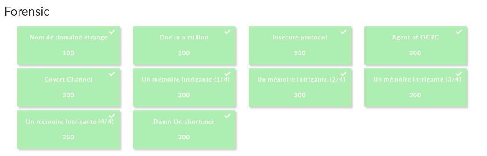

# Forensics :exclamation:
> In a CTF context, "Forensics" challenges can include file format analysis, steganography, memory dump analysis, or network packet capture analysis. Any challenge to examine and process a hidden piece of information out of static data files (as opposed to executable programs or remote servers) could be considered a Forensics challenge (unless it involves cryptography, in which case it probably belongs in the Crypto category). 

 

    

