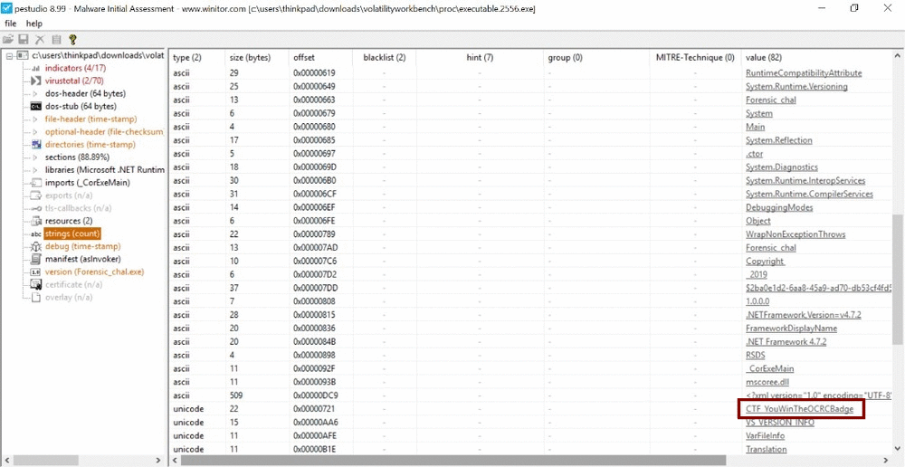

* * *
# Un mémoire intrigante (4/4)
> (Forensic, 200 points )
---
## Challenge :
> Le bjCSIRT a été dépeché pour assiter l'OCRC lors de la perquisition du domicile du bras droit de DJAKPATAGLO. Arrivé sur les lieux, ils ont fait l'inventaire des objets trouvés. Parmi ces objets, un ordinateur allumé. L'équipe a naturellement procédé à l'acquisition de la mémoire vive de ce ordinateur. Lors de l'investigation, ils ont découvert que le suspect préparait un malware dangereux.


**```NB```**: Le dump de la mémoire vive est téléchargeable sur les clés USB, partagées lors de la phase présentielle de la finale du HackerLab2019. 

Le premier objectif du challenge serait d'extraire du **dump**, **le malware** dont il est question dans la description. Pour le faire, il faudrait commencer par exécuter la commande suivante :

```console 
root@Y3HW3_Hack3r:~/HackerLab2019# volatility -f memdump.mem --profile=Win7SP1x64 pslist
Volatility Foundation Volatility Framework 2.6
Offset(V)          Name                    PID   PPID   Thds     Hnds   Sess  Wow64 Start                          Exit                          
------------------ -------------------- ------ ------ ------ -------- ------ ------ ------------------------------ ------------------------------
0xfffffa80018c9040 System                    4      0     86      559 ------      0 2019-10-25 09:48:51 UTC+0000                                 
0xfffffa8002a44420 smss.exe                276      4      2       29 ------      0 2019-10-25 09:48:51 UTC+0000                                 
0xfffffa800337cb30 csrss.exe               344    336      9      423      0      0 2019-10-25 09:48:52 UTC+0000                                 
0xfffffa800314f910 wininit.exe             380    336      3       75      0      0 2019-10-25 09:48:52 UTC+0000                                 
0xfffffa8003395b30 csrss.exe               392    372      9      466      1      0 2019-10-25 09:48:52 UTC+0000                                 
0xfffffa80033a4060 winlogon.exe            432    372      3      108      1      0 2019-10-25 09:48:52 UTC+0000                                 
0xfffffa8003366b30 services.exe            476    380      7      200      0      0 2019-10-25 09:48:52 UTC+0000                                 
0xfffffa8003422b30 lsass.exe               492    380      8      732      0      0 2019-10-25 09:48:52 UTC+0000                                 
0xfffffa80033dbb30 lsm.exe                 504    380     10      149      0      0 2019-10-25 09:48:52 UTC+0000                                 
0xfffffa80034c1060 svchost.exe             604    476     10      356      0      0 2019-10-25 09:48:53 UTC+0000                                 
0xfffffa80034e1540 VBoxService.ex          668    476     11      116      0      0 2019-10-25 09:48:53 UTC+0000                                 
0xfffffa80034f5b30 svchost.exe             732    476      7      286      0      0 2019-10-25 09:48:53 UTC+0000                                 
0xfffffa8003525460 svchost.exe             816    476     23      608      0      0 2019-10-25 09:48:53 UTC+0000                                 
0xfffffa8003590060 svchost.exe             896    476     28      543      0      0 2019-10-25 09:48:53 UTC+0000                                 
0xfffffa8003599b30 svchost.exe             920    476     38     1095      0      0 2019-10-25 09:48:53 UTC+0000                                 
0xfffffa80035ddb30 svchost.exe             336    476     19      499      0      0 2019-10-25 09:48:53 UTC+0000                                 
0xfffffa800361cb30 svchost.exe            1036    476     18      369      0      0 2019-10-25 09:48:54 UTC+0000                                 
0xfffffa800364db30 dwm.exe                1168    896      3       71      1      0 2019-10-25 09:48:54 UTC+0000                                 
0xfffffa800368b490 explorer.exe           1180   1152     31      955      1      0 2019-10-25 09:48:54 UTC+0000                                 
0xfffffa800367cb30 spoolsv.exe            1240    476     13      289      0      0 2019-10-25 09:48:54 UTC+0000                                 
0xfffffa80036ee450 taskhost.exe           1284    476      8      211      1      0 2019-10-25 09:48:54 UTC+0000                                 
0xfffffa80036f6b30 svchost.exe            1308    476     18      311      0      0 2019-10-25 09:48:54 UTC+0000                                 
0xfffffa800376a3e0 armsvc.exe             1412    476      4       73      0      1 2019-10-25 09:48:54 UTC+0000                                 
0xfffffa80037f1060 VBoxTray.exe           1496   1180     12      156      1      0 2019-10-25 09:48:54 UTC+0000                                 
0xfffffa800387f060 Service_KMS.ex         1764    476      9      595      0      0 2019-10-25 09:48:55 UTC+0000                                 
0xfffffa8003320900 svchost.exe            1992    476      5       97      0      0 2019-10-25 09:48:56 UTC+0000                                 
0xfffffa80039dd6c0 WmiPrvSE.exe           2168    604      7      177      0      0 2019-10-25 09:48:58 UTC+0000                                 
0xfffffa800396bb30 WmiPrvSE.exe           2176    604      6      127      0      0 2019-10-25 09:48:58 UTC+0000                                 
0xfffffa8003a9fb30 SearchIndexer.         2620    476     13      645      0      0 2019-10-25 09:49:01 UTC+0000                                 
0xfffffa8003965060 svchost.exe            1744    476     23 --------      0      0 2019-10-25 09:49:36 UTC+0000                                 
0xfffffa8003a50060 svchost.exe            1984    476     13      317      0      0 2019-10-25 09:51:02 UTC+0000                                 
0xfffffa800380b060 wmpnetwk.exe           1196    476     15      442      0      0 2019-10-25 09:51:02 UTC+0000                                 
0xfffffa80038caaa0 svchost.exe            2248    476      7      342      0      0 2019-10-25 09:56:00 UTC+0000                                 
0xfffffa8001b07670 audiodg.exe            1988    816      4      122      0      0 2019-10-25 12:51:16 UTC+0000                                 
0xfffffa8001a86060 firefox.exe            2788   1912     60      918      1      0 2019-10-25 17:09:41 UTC+0000                                 
0xfffffa8001b62b30 firefox.exe            2480   2788     10      204      1      0 2019-10-25 17:09:41 UTC+0000                                 
0xfffffa800348b410 firefox.exe            2524   2788     25      344      1      0 2019-10-25 17:09:42 UTC+0000                                 
0xfffffa8001e8b530 firefox.exe            1384   2788     21      306      1      0 2019-10-25 17:09:42 UTC+0000                                 
0xfffffa80037af960 firefox.exe            3144   2788      0 --------      1      0 2019-10-25 17:09:42 UTC+0000   2019-10-25 17:09:48 UTC+0000  
0xfffffa80039a0060 firefox.exe            3708   2788     21      302      1      0 2019-10-25 17:09:43 UTC+0000                                 
0xfffffa8001cf0910 firefox.exe            2804   2788      0 --------      1      0 2019-10-25 17:09:44 UTC+0000   2019-10-25 17:10:49 UTC+0000  
0xfffffa8001cf3b30 firefox.exe            2368   2788     19      290      1      0 2019-10-25 17:09:46 UTC+0000                                 
0xfffffa8001c5f060 notepad.exe            4180   1180      1       64      1      0 2019-10-25 17:10:01 UTC+0000                                 
0xfffffa8001e85060 cmd.exe                4228   1180      1       23      1      0 2019-10-25 17:10:13 UTC+0000                                 
0xfffffa800309b6c0 conhost.exe            4236    392      2       57      1      0 2019-10-25 17:10:13 UTC+0000                                 
0xfffffa8001d2c060 telnet.exe             4296   4228      3       54      1      0 2019-10-25 17:10:32 UTC+0000                                 
0xfffffa800197db30 dangerous_malw         2556   1180      7      111      1      1 2019-10-25 17:12:13 UTC+0000                                 
0xfffffa8001cd4390 conhost.exe            4196    392      2       54      1      0 2019-10-25 17:12:14 UTC+0000                                 
0xfffffa8001cbf1f0 FTK Imager.exe         4288   1180     18      385      1      0 2019-10-25 17:12:48 UTC+0000                                 
```
En analysant minitieusement la sortie de la commande précédente, on repère parmi les processus , un programme **dangerous_malw**. La prochaine étape serait donc d'effectuer un dump du fameux **malware**. D'abord, le **pid** du processus est : **2556**. 

```console 
root@Y3HW3_Hack3r:~/HackerLab2019# volatility -f memdump.mem --profile=Win7SP1x64 procdump --dump-dir . --pid=2556
volatility -f memdump.mem --profile=Win7SP1x64 procdump --dump-dir . --pid=2556
Volatility Foundation Volatility Framework 2.6
Process(V)         ImageBase          Name                 Result
------------------ ------------------ -------------------- ------
0xfffffa800197db30 0x0000000001040000 dangerous_malw       OK: executable.2556.exe
```
Voilà notre **malware** enfin dumpé sous le nom de **executable.2556.exe**. Essayons donc de l'examiner avec le célèbre logiciel d'analyse de malware qui est **pestudio** (https://www.winitor.com/).



On remarque que dans l'onget **Strings (count)** , nous retrouvons notre ```flag```.

```Flag ```: **CTF_YouWinTheOCRBadge**
