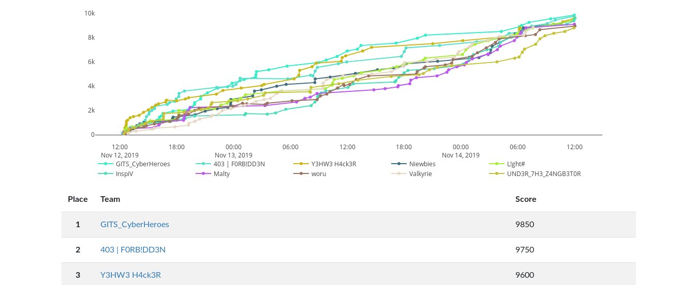

# HackerLab2019 Final
> Writeup de la phase finale du hackerlab 2019 !
---
## Tableau des scores

## Les Challenges du CTF
<table>
	<thead>
		<th>Epreuve</th>
		<th>Catégorie</th>
		<th>Points</th>
	</thead>
	<tr>
		<td>CryptoMiner?</td>
		<td>Reverse Engineering</td>
		<td>150</td>
	</tr>
	<tr>
		<td>Patch Me</td>
		<td>Reverse Engineering</td>
		<td>200</td>
	</tr>
	<tr>
		<td>Friendly ransomware</td>
		<td>Reverse Engineering</td>
		<td>200</td>
	</tr>
	<tr>
		<td>Evil dropper</td>
		<td>Reverse Engineering</td>
		<td>250</td>
	</tr>
	<tr>
		<td>Matheux</td>
		<td>Reverse Engineering</td>
		<td>300</td>
	</tr>
	<tr>
		<td>Hello HackerLab</td>
		<td>Reverse Engineering</td>
		<td>300</td>
	</tr>	
	<tr>
		<td>NTFS</td>
		<td>Steganography</td>
		<td>100</td>
	</tr>
	<tr>
		<td>Photo de famille</td>
		<td>Steganography</td>
		<td>100</td>
	</tr>
	<tr>
		<td>Message secret</td>
		<td>Steganography</td>
		<td>150</td>
	</tr>
	<tr>
		<td>Fichier corrompu</td>
		<td>Steganography</td>
		<td>150</td>
	</tr>
	<tr>
		<td>Convert channel</td>
		<td>Steganography</td>
		<td>200</td>
	</tr>
	<tr>
		<td>Amazones jumelles</td>
		<td>Steganography</td>
		<td>250</td>
	</tr>
	<tr>
		<td>Le chant des guerrières</td>
		<td>Steganography</td>
		<td>300</td>
	</tr>
	<tr>
		<td>Shit!</td>
		<td>Steganography</td>
		<td>300</td>
	</tr>
	<tr>
		<td>Break Me</td>
		<td>Steganography</td>
		<td>500</td>
	</tr>
	<tr>
		<td>Code de Houégbadja</td>
		<td>Crypto</td>
		<td>100</td>
	</tr>
	<tr>
		<td>Very simple hiding</td>
		<td>Crypto</td>
		<td>100</td>
	</tr>
	<tr>
		<td>Trop facile</td>
		<td>Crypto</td>
		<td>100</td>
	</tr>
	<tr>
		<td>Ingénieux</td>
		<td>Crypto</td>
		<td>150</td>
	</tr>
	<tr>
		<td>Le rail et la barrière</td>
		<td>Crypto</td>
		<td>200</td>
	</tr>
	<tr>
		<td>a^b</td>
		<td>Crypto</td>
		<td>300</td>
	</tr>
	<tr>
		<td>Ancient Language</td>
		<td>Crypto</td>
		<td>300</td>
	</tr>
	<tr>
		<td>AES</td>
		<td>Crypto</td>
		<td>500</td>
	</tr>
	<tr>
		<td>Que faire?</td>
		<td>Web</td>
		<td>100</td>
	</tr>
	<tr>
		<td>Confiance zéro!</td>
		<td>Web</td>
		<td>150</td>
	</tr>
	<tr>
		<td>Javascript 1/2</td>
		<td>Web</td>
		<td>150</td>
	</tr>
	<tr>
		<td>Javascript 2/2</td>
		<td>Web</td>
		<td>150</td>
	</tr>
	<tr>
		<td>Choosy web server </td>
		<td>Web</td>
		<td>150</td>
	</tr>
	<tr>
		<td>Ginger Oh Jinja! </td>
		<td>Web</td>
		<td>300</td>
	</tr>
	<tr>
		<td>File Reader! </td>
		<td>Web</td>
		<td>300</td>
	</tr>
	<tr>
		<td>Armageddon (End Game) </td>
		<td>Web</td>
		<td>300</td>
	</tr>
	<tr>
		<td>La porte du couvent </td>
		<td>Web</td>
		<td>400</td>
	</tr>
		<tr>
		<td>La porte du couvent 2</td>
		<td>Web</td>
		<td>400</td>
	</tr>
	<tr>
		<td>Jenkins </td>
		<td>Web</td>
		<td>400</td>
	</tr>
	<tr>
		<td>La boîte à secret </td>
		<td>Web</td>
		<td>450</td>
	</tr>
	<tr>
		<td>Bienvenue au hackerlab </td>
		<td>Miscellaneous</td>
		<td>100</td>
	</tr>
		<tr>
		<td>Bad practice </td>
		<td>Miscellaneous</td>
		<td>100</td>
	</tr>
	<tr>
		<td>Rooter </td>
		<td>Miscellaneous</td>
		<td>300</td>
	</tr>
	<tr>
		<td>Nom de domaine étrange </td>
		<td>Forensic</td>
		<td>100</td>
	</tr>
	<tr>
		<td>One in a million </td>
		<td>Forensic</td>
		<td>100</td>
	</tr>
	<tr>
		<td>Insecure protocol </td>
		<td>Forensic</td>
		<td>150</td>
	</tr>
	<tr>
		<td>Agent of OCRC </td>
		<td>Forensic</td>
		<td>200</td>
	</tr>
	<tr>
		<td>Convert channel </td>
		<td>Forensic</td>
		<td>200</td>
	</tr>
	<tr>
		<td>Une mémoire intrigante (1/4) </td>
		<td>Forensic</td>
		<td>200</td>
	</tr>
	<tr>
		<td>Une mémoire intrigante (2/4) </td>
		<td>Forensic</td>
		<td>200</td>
	</tr>
	<tr>
		<td>Une mémoire intrigante (3/4) </td>
		<td>Forensic</td>
		<td>200</td>
	</tr>
	<tr>
		<td>Une mémoire intrigante (4/4) </td>
		<td>Forensic</td>
		<td>250</td>
	</tr>
	<tr>
		<td>Damn Url Shortener </td>
		<td>Forensic</td>
		<td>300</td>
	</tr>
</table>
