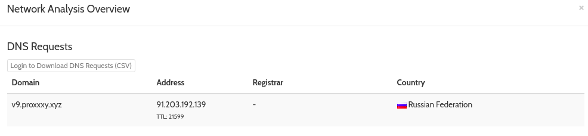
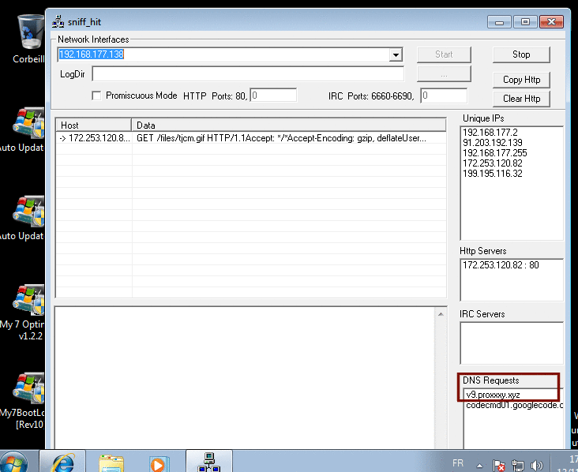

* * *
# CryptoMiner?
> (Reverse Engineering, 150 points )
---
## Challenge :
> Trouver le domaine que ce malware essaie de contacter et renseignez-le comme flag. Attention: Ceci est un vrai malware. Traitez-le seulement dans un sandbox. Mot de passe ouverture du zip: miner [ [crypto_miner.zip](File/crypto_miner.zip ) ]

L'objectif de ce challenge, est d'arriver à trouver le **domaine** qu'essaie de contacter **le malware** extrait du zip.
### 1ère méthode :

Pour analyser **le malware**, nous utiliserons la célèbre plateforme ```hybrid analysis``` (https://www.hybrid-analysis.com). 
Après avoir uploadé le malware, on se rend dans :
> Incident Response > Risk Assessment > View all detail 



Nous aperçevons le domaine qu'essaie de joindre notre **malware** : *v9.proxxxy.xyz*

### 2ème méthode :

Une autre option, serait d'utiliser **l’outil sniff_hit**  de la suite **sysanalyser (http://sandsprite.com/iDef/SysAnalyzer/)** .  On démarre le logiciel **sniff_hit** en tant qu’administrateur, puis on lance le *sniffing* pour voir les différentes requêtes **DNS**.



```Flag ```: **v9.proxxxy.xyz**