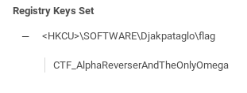

* * *
# Friendly ransomware
> (Reverse Engineering, 200 points )
---
## Challenge :
> Il semble que pour augmenter ses revenus, Djakpataglo envisageait de quitter le gaye pour entrer dans le piratage professionel. Les renseignements indiquent qu'il se serait attaché les services des hackers de l'Est, les GankpaBrokers. Ils avaient démarré le développement d'un ransomware qui semble-t-il n'est pas encore très bien finalisé. bjCSIRT a mis la main dessus et demande l'expertise des cyber-amazones pour comprendre son fonctionnement. [ [ransomware.exe](File/ransomware.exe ) ]

Concernant ce challenge, l'objectif est d'analyser le fonctionnement du **ransomware**. Pour cela, on utilisera la plateforme https://www.virustotal.com réputée pour l'analyse des programmes malveillants. Il pourra nous donner plus de détails sur l'exécutable ```ransomware.exe```. Après s'être rendu sur la plateforme, il faudra : 

> Uploader l'exécutable puis se rendre dans l'option Behavior pour une analyse plus approfondie. 

En défilant plus bas, du côté des ```registers```, on fini par retrouver notre ```flag```.




```Flag ```: **CTF_AlphaReverserAndTheOnlyOmega**