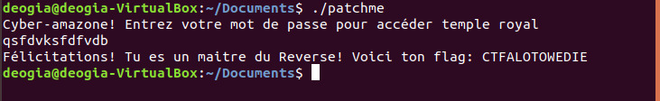

* * *
# Patch Me
> (Reverse Engineering, 200 points )
---
## Challenge :
> Pourras-tu modifier ce programme pour avoir le flag?  [ [patchme](File/patchme ) ]

```NB ```: **Faut avouer que ce challenge est très intéressant. Notre équipe a vraiment consacré un max de temps dessus pendant la compétition mais sans finalement obtenir le résultat escompté. Question de chance pour ceux qui ont résolu ? Ou défaut de concentration pour notre équipe ? Vous en aurez une idée en lisant jusqu'à la fin.**  

En se référant au nom de cette épreuve, on pourrait déjà avoir une idée de l'objectif du challenge. Il serait probablement question de modifier un ```flux d'instruction``` dans le programme pour pourvoir afficher le ```flag```.  
Commençons d'abord par exécuter notre programme pour analyser son fonctionnement.
```console
root@Y3HW3_Hack3r:~/HackerLab2019# chmod +x patchme
root@Y3HW3_Hack3r:~/HackerLab2019# ./patchme 
Cyber-amazone! Entrez votre mot de passe pour accéder temple royal
flag
Essaie encore
```
On constate rapidement que, quand le ```flag``` renseigné en ```input``` n'est pas correct, le message en ```output``` est **"Essaie encore"**. Ainsi, dans le cas où le ```flag``` renseigné serait correct, on aura un message de ```félicitation```. **Probalement !**  
Vérifions notre hypothèse avec la commande ```strings```.  
```console
root@Y3HW3_Hack3r:~/HackerLab2019# strings patchme
/lib64/ld-linux-x86-64.so.2
libc.so.6
[..............................]
VRHVf
AWAVI
AUATL
[]A\A]A^A_
Cyber-amazone! Entrez votre mot de passe pour acc
der temple royal
CWJZRXRXUYNGX
licitations! Tu es un maitre du Reverse! Voici ton flag: %s
Essaie encore
;*3$"
GCC: (Ubuntu 7.4.0-1ubuntu1~18.04.1) 7.4.0
[..............................]
.data
.bss
.comment
```
On peut rapidement aperçevoir une phrase exprimant un message de félicitation **"Félicitations! Tu es un maitre du Reverse! Voici ton flag: %s"**. A la fin de ce message, nous voyons un **"%s"**. Conclusion évidente, notre ```flag``` s'affiche à ce niveau.
Il faudrait donc faire une analyse approfondie de l'exécutable pour voir dans quel cas le message en ```output```  est **"Félicitations! Tu es un maitre du Reverse! Voici ton flag: %s"**. Pour cela, nous allons utiliser un logiciel de désassemblage d'exécutable pour analyser de façon statique l'exécutable ```patchme```. D'abord il convient de souligner que le programme ```patchme``` est un ```ELF 64-bit```. Le logiciel que nous avions choisi pour désassembler le programme est le célèbre ```radare2```.
```console
root@Y3HW3_Hack3r:~/HackerLab2019# r2 ./patchme
[0x00000780]> aaaa
[x] Analyze all flags starting with sym. and entry0 (aa)
[x] Analyze function calls (aac)
[x] Analyze len bytes of instructions for references (aar)
[x] Constructing a function name for fcn.* and sym.func.* functions (aan)
[x] Enable constraint types analysis for variables
[0x00000780]> s main
[0x00000af3]> pdf
/ (fcn) main 238
|   main (int argc, char **argv, char **envp);
|           ; var int local_40h @ rbp-0x40
|           ; var int local_38h @ rbp-0x38
|           ; var int local_30h @ rbp-0x30
|           ; var int local_24h @ rbp-0x24
|           ; var int local_16h @ rbp-0x16
|           ; var int local_eh @ rbp-0xe
|           ; var int local_ah @ rbp-0xa
|           ; var int local_8h @ rbp-0x8
|           ; DATA XREF from entry0 (0x79d)
|           0x00000af3      55             push rbp
|           0x00000af4      4889e5         mov rbp, rsp
|           0x00000af7      4883ec40       sub rsp, 0x40
|           0x00000afb      64488b042528.  mov rax, qword fs:[0x28]    ; [0x28:8]=0x2130 ; '('
|           0x00000b04      488945f8       mov qword [local_8h], rax
|           0x00000b08      31c0           xor eax, eax
|           0x00000b0a      488d3d670100.  lea rdi, qword str.Cyber_amazone__Entrez_votre_mot_de_passe_pour_acc__der_temple_royal ; 0xc78 ; "Cyber-amazone! Entrez votre mot de passe pour acc\u00e9der temple royal"
|           0x00000b11      e8dafbffff     call sym.imp.puts           ; int puts(const char *s)
|           0x00000b16      488d45dc       lea rax, qword [local_24h]
|           0x00000b1a      4889c6         mov rsi, rax
|           0x00000b1d      488d3d980100.  lea rdi, qword [0x00000cbc] ; "%s"
|           0x00000b24      b800000000     mov eax, 0
|           0x00000b29      e822fcffff     call sym.imp.__isoc99_scanf ; int scanf(const char *format)
|           0x00000b2e      bf0e000000     mov edi, 0xe
|           0x00000b33      e808fcffff     call sym.imp.malloc         ;  void *malloc(size_t size)
|           0x00000b38      488945c0       mov qword [local_40h], rax
|           0x00000b3c      48b858414257.  movabs rax, 0x4756474457424158 ; 'XABWDGVG'
|           0x00000b46      488945ea       mov qword [local_16h], rax
|           0x00000b4a      c745f2565248.  mov dword [local_eh], 0x56485256 ; 'VRHV'
|           0x00000b51      66c745f65100   mov word [local_ah], 0x51   ; 'Q'
|           0x00000b57      488d45ea       lea rax, qword [local_16h]
|           0x00000b5b      4889c7         mov rdi, rax
|           0x00000b5e      e827fdffff     call sub.strdup_88a
|           0x00000b63      488945c0       mov qword [local_40h], rax
|           0x00000b67      488b55c0       mov rdx, qword [local_40h]
|           0x00000b6b      488d45dc       lea rax, qword [local_24h]
|           0x00000b6f      4889d6         mov rsi, rdx
|           0x00000b72      4889c7         mov rdi, rax
|           0x00000b75      e8b6fbffff     call sym.imp.strcmp         ; int strcmp(const char *s1, const char *s2)
|           0x00000b7a      85c0           test eax, eax
|       ,=< 0x00000b7c      753c           jne 0xbba
|       |   0x00000b7e      488d053a0100.  lea rax, qword str.CWJZRXRXUYNGX ; 0xcbf ; "CWJZRXRXUYNGX"
|       |   0x00000b85      488945c8       mov qword [local_38h], rax
|       |   0x00000b89      488b55c0       mov rdx, qword [local_40h]
|       |   0x00000b8d      488b45c8       mov rax, qword [local_38h]
|       |   0x00000b91      4889d6         mov rsi, rdx
|       |   0x00000b94      4889c7         mov rdi, rax
|       |   0x00000b97      e8b7fdffff     call sub.strlen_953
|       |   0x00000b9c      488945d0       mov qword [local_30h], rax
|       |   0x00000ba0      488b45d0       mov rax, qword [local_30h]
|       |   0x00000ba4      4889c6         mov rsi, rax
|       |   0x00000ba7      488d3d220100.  lea rdi, qword str.F__licitations__Tu_es_un_maitre_du_Reverse__Voici_ton_flag:__s ; 0xcd0 ; "F\u00e9licitations! Tu es un maitre du Reverse! Voici ton flag: %s\n"
|       |   0x00000bae      b800000000     mov eax, 0
|       |   0x00000bb3      e868fbffff     call sym.imp.printf         ; int printf(const char *format)
|      ,==< 0x00000bb8      eb0c           jmp 0xbc6
|      ||   ; CODE XREF from main (0xb7c)
|      |`-> 0x00000bba      488d3d4f0100.  lea rdi, qword str.Essaie_encore ; 0xd10 ; "Essaie encore"
|      |    0x00000bc1      e82afbffff     call sym.imp.puts           ; int puts(const char *s)
|      |    ; CODE XREF from main (0xbb8)
|      `--> 0x00000bc6      b800000000     mov eax, 0
|           0x00000bcb      488b4df8       mov rcx, qword [local_8h]
|           0x00000bcf      6448330c2528.  xor rcx, qword fs:[0x28]
|       ,=< 0x00000bd8      7405           je 0xbdf
|       |   0x00000bda      e831fbffff     call sym.imp.__stack_chk_fail ; void __stack_chk_fail(void)
|       |   ; CODE XREF from main (0xbd8)
|       `-> 0x00000bdf      c9             leave
\           0x00000be0      c3             ret

``` 
Après une brève analyse de cette sortie de code assembleur, on peut énumérer ces quelques points :  
1) A l'adresse ```0x00000b29```, le programme réccupère l'entrée de l'utilisateur.
2) A l'adresse ```0x00000b75```, la fonction **strcmp** est appelée pour comparer l'entrée de l'utilisateur à une certaine chaîne de caractères.
3) Lorsque cette comparaison est fausse, le programme **jump** dans le bloc **0xbba**, où le message de sortie est **"Essaie encore""**.
4) Lorsque cette comparaison est correcte, le programme continu son chemin et entre dans le bloc **0x00000b7c**. A ce niveau une certaine variable est initialisée à **"CWJZRXRXUYNGX"**. Cette variable est passée à une fonction *sub.strlen_953()*
5) Cette fonction décrypte la chaîne passée en argument suivant un algorithme personnalisée. Ainsi le ```return``` de **sub.strlen_953("CWJZRXRXUYNGX")** serait le ```flag```.  

En se basant sur ces 05 points, pour avoir le ```flag ```, on aura qu'à changer l'instruction **0x00000b7c 753c jne 0xbba** en **0x00000b7c 753c jne 0x00000b7e**. Ainsi, même quand l'utilisateur va renseigner un flag incorrect, le programme continuera son chemin dans le bloc où le ```flag``` est décrypté et affiché. Pour le faire :
```console
[0x00000af3]> s 0x00000b7c
[0x00000b7c]> pd 1
|       ,=< 0x00000b7c      753c           jne 0xbba
[0x00000b7c]> oo+
[0x00000b7c]> wa jne 0x00000b7e
Written 2 byte(s) (jne 0x00000b7e) = wx 7500
[0x00000b7c]> pd 1
|       ,=< 0x00000b7c      7500           jne 0xb7e
[0x00000b7c]>q
```
Voilà notre programme finalement patché. Pour obtenir le ```flag```, il suffira d'exécuter le programme et mettre un ```input```quelconque.  
Rappelez-vous qu'au début on a parlé de **<< Question de chance pour ceux qui ont résolu ? Ou défaut de concentration pour notre équipe ? >>**. Certains de ceux qui ont réussi à patcher le programme tel décrit dans ce writeup sauront de quoi on parle. En effet, sur certains systèmes d'exploitation , après un patch du programme, on a des **erreurs de segmentation**. Impossible d'afficher le ```flag```. Chose qui a empêché notre équipe de valider cette épreuve. 

Mais après la compétition, quelques recherches effectuées ont finalement montré que c'était un problème de compilateur. Pour s'éviter donc cette fameuse erreur, il est nécessaire d'éxécuter le programme patché sur un système doté de la version **7.4.0** de **gcc**. Tel, un **Ubuntu 18.04**.



Nos sincères remerciements à l'adresse de [@xdeogia](https://twitter.com/angbedji) , pour avoir accepté exécuter notre programme patché sur son système Ubuntu 18.04 .

```Flag ```: **CTFALOTOWEDIE**
