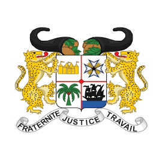
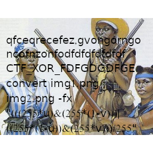

* * *
# Amazones jumelles
> (Steganography, 250 points )
---
## Challenge :
> La puissance des jumelles, c'est qu'elles vont toujours de pair. C'était pareil pour les amazones.  [ [a.png](File/a.png ) ] [ [aa.png](File/aa.png ) ]

Pour ce challenge, on nous présente deux images .

 

En regardant attentivement les deux images, on remarque qu'une combinaison des deux, pourrait faire ressortir le texte se trouvant sur la deuxième image. Pour le faire, on utilisera le célèbre outil de **stéganographie** qui est bien évidemment **stegsolve (https://github.com/eugenekolo/sec-tools/tree/master/stego/stegsolve/stegsolve)**.

> D’abord, nous ouvrons la première image [a.png](File/a.png ) avec l’outil ```stegsolve```, ensuite on clique sur  Analyse > "Image combiner", puis on choisi la seconde image.

Après ceci, nous obtenons une nouvelle image sur laquelle est visible notre ```flag``` : 



```Flag : ``` **CTF_XOR_FDFGDGDFGE**
