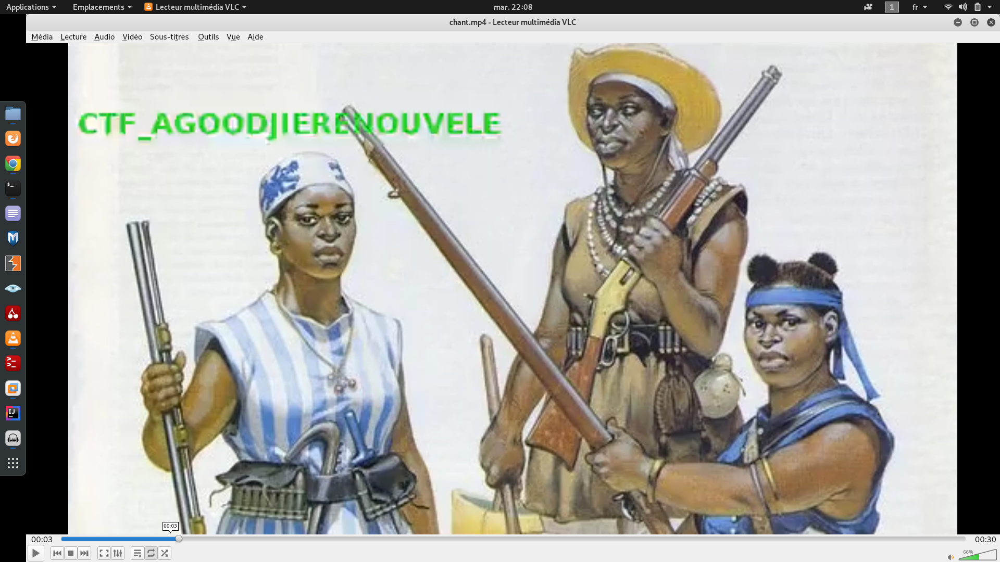

* * *
# Le chant des guerrières
> (Steganography, 300 points )
---
## Challenge :
> AGOODJIE ou le chant des guerrières. Les cyber-amazones entonnaient souvent ce chant sacré pour retrouver le flag caché. [ [chant.tar.7z](File/chant.tar.7z ) ]

Pour ce challenge, l'extraction du fichier ```chant.tar.7z```, nous donne une vidéo. Dans la description du challenge, on note ceci : **«Les cyber-amazones entonnaient souvent ce chant sacré pour retrouver le flag caché. »**. Ainsi, pour commencer , on va lire la vidéo avec un lecteur (**VLC**). En pleine lecture, on remarque qu’un message passait rapidement à l’écran. Du coup on met la vidéo sur ```ralenti```, puis on fini par retrouver le ```flag``` sur une certaine ```frame```.



```Flag : ``` **CTF_AGOODJIERENOUVELE**