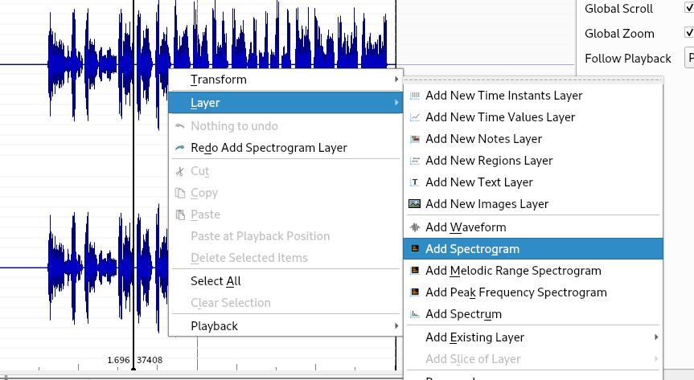
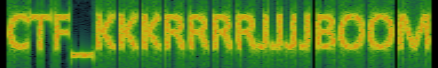

* * *
# Message secret
> (Steganography, 150 points )
---
## Challenge :
> Retrouve le message secret laissé par les agents secrets aux cyber-amazones.  [ [steg01.wav](File/steg01.wav ) ]

Cette fois-ci, nous avons à faire avec un ```fichier audio```. Dans la plupart des cas, caché un **message secret** dans un audio, revient à insérer ce message dans le **spectrogramme** de l'audio. Plusieurs logiciels permettent d'avoir une vue sur le spectrogramme d'un audio. On a : **Audacity** (https://www.audacityteam.org/download/) , **Sonic Visualiser** (https://www.sonicvisualiser.org/download.html)

Pour résoudre ce challenge, nous ferions usage du célèbre logiciel **Sonic Visualiser**.
> Une fois ouvert, nous chargeons l'audio, nous faisons un clic droit sur le ```waveform```, puis nous cliquons sur ```Add spectrogram```




Juste après ceci, nous aperçevons notre message secret qui n'est rien d'autre que le ```flag``` recherché.




```Flag : ``` **CTF_KKKRRRRJJJJBOOM**