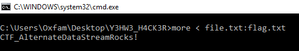

* * *
# NTFS
> (Steganography, 100 points )
---
## Challenge :
> Le système de fichiers NTFS cache des secrets. A toi de le découvrir.  [ [file.rar](File/file.rar ) ]

L'archive téléchargée ```file.rar``` contient un fichier ```file.txt``` donc le contenu est présenté ci-dessous :
```console
root@Y3HW3_Hack3r:~/HackerLab2019# cat file.txt
Rien à voir ici?
```
L'exécution de la commande ```strings``` sur l'archive ```file.rar``` révèle la présence d'un fichier ```flag.txt```. 
```console
root@Y3HW3_Hack3r:~/HackerLab2019# strings file.txt
Rar!
file.txt
Rien 
 voir ici?
}4xm
:flag.txt
```
Or, après l'extraction de l'archive, aucun fichier ```flag.txt``` n'est retrouvé. Après quelques recherches, nous tombons sur un fameux article qui aborde **une méthode permettant de cacher une donnée dans un fichier texte, chose fonctionnelle que sur un système de fichier** ```NTFS```. ( https://www.howtogeek.com/howto/windows-vista/stupid-geek-tricks-hide-data-in-a-secret-text-file-compartment/ )  
Pour obtenir le contenu du fichier ```flag.txt```, il suffit d'ouvrir **l'invite de commande de Windows**, se rendre dans le répertoire du fichier ```file.txt``` et d'exécuter la commande suivante :  

  

```Flag : ``` **CTF_AlternateDataStreamRocks!**


