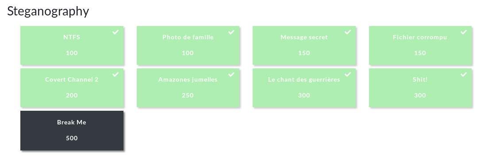

# Steganography :exclamation:
> Steganography is the art or practice of concealing a message, image, or file within another message, image, or file. - [Wikipedia ](http://en.wikipedia.org/wiki/Steganography)

In the context of CTFs steganography usually involves finding the hints or flags that have been hidden with steganography. Most commonly a media file will be given as a task with no further instructions, and the participants have to be able to uncover the message that has been encoded in the media.

