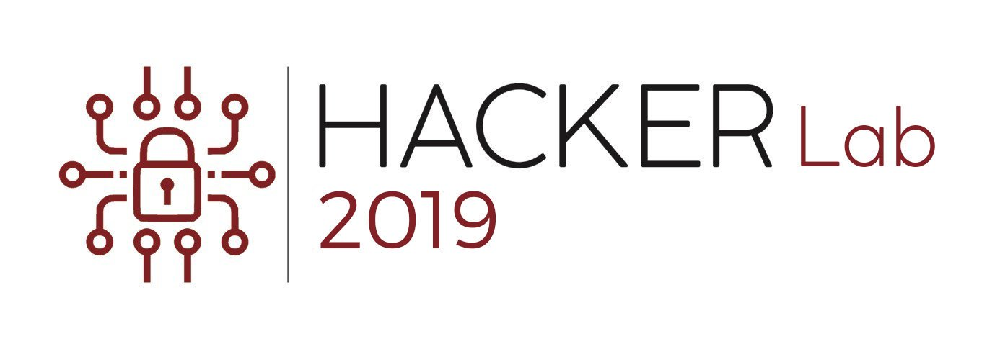
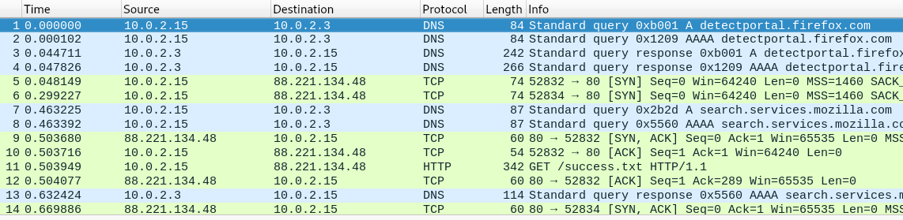
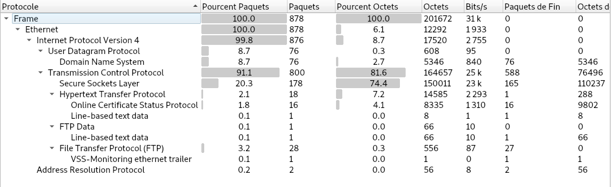
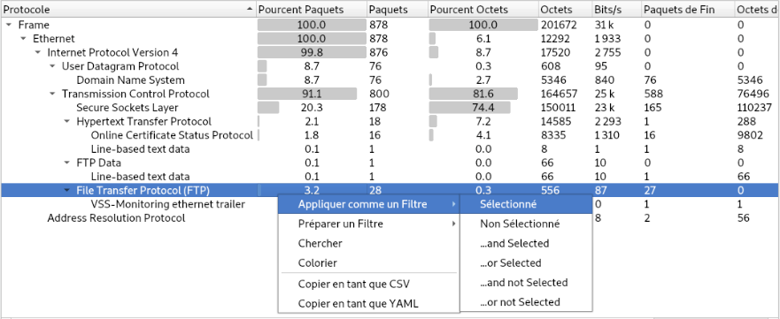
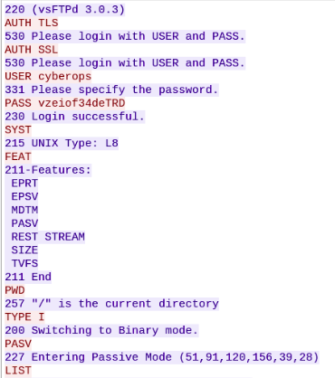

# HackerLab2019
> Write-up de la phase de préselection !
---

## Challenge : Tweet de @Anssi_Benin : 12:14 Pm - 01 Octobre 2019
>Etudiants, curieux, auto-didactes, professionnels de l'informatique, les qualifs du ```#HackerLab2019``` commencent maintenant. Soyez parmi les 100 premiers à valider le flag. Formez votre team entrez dans la bagarre.
[bit.ly/2oW96UH](https://bit.ly/2oW96UH)
---
### 1ère Etape: Forensic
L’accèss au lien du challenge https://bit.ly/2oW96UH (http://qualif.hackerlab.bj/qualif.pcap) permet de télécharger un fichier ```PCAP```. Ce fichier PCAP nommé ```qualif.pcap``` contient assez d’information. Retrouver toutes les informations necessaires pour l’évolution est un grand défi à relever. Le logiciel utilisé pour l'analyse de ce fichier est le célèbre  ```wireshark```. 



Une fois ouvert, allons dans l’onglet ```Statistiques > Hiérarchie des Protocoles``` pour connaître les protocoles utilisés.



Dans la liste de ces protocoles, nous repérons le protocole FTP. On pourrait donc conclure sur une connexion probable à un serveur de fichier. Allons chercher un peu plus d’informations sur les échanges éffectués avec ce protocole.
> Sélectionner File Transfer Protocol (FTP) > Clique droit > Appliquer comme un Filtre > Sélectionné



Après l’affichage des différents échanges, faisons sur la première ligne un ```clique droit > Suivre > Flux TCP```. On voit donc apparaître une fenêtre renseignant sur les **credentials** utilisés pour la connexion au serveur ```FTP```. 



Ayant l’adresse **IP** du serveur FTP : ```51.91.120.156``` , un username : **cyberops** puis un password : **vzeiof34deTRD**, nous pouvons maintenant nous connecter au **serveur FTP**, question de voir ce qui s'y trouve.
```console
root@Y3HW3_Hack3r:~/HackerLab2019# ftp 51.91.120.156 
Connected to 51.91.120.156.
220 (vsFTPd 3.0.3)
Name (51.91.120.156:root): cyberops
331 Please specify the password.
Password:
230 Login successful.
Remote system type is UNIX.
Using binary mode to transfer files.
ftp> dir
200 PORT command successful. Consider using PASV.
150 Here comes the directory listing.
-rw-r--r--    1 1001     1001         4469 Oct 01 12:52 qualif.zip
-rw-r--r--    1 1001     1001         1221 Oct 01 16:16 readme
226 Directory send OK.
ftp> 
```
Une fois la connexion établie, nous vérifions les différents fichiers qui se trouvent sur le serveur, puis faisons un téléchargement de ces derniers avec l’aide des commandes **lcd** et **get**.
```
ftp> lcd .
Local directory now /home/Y3HW3_Hack3r/HackerLab2019
ftp> get qualif.zip
local: qualif.zip remote: qualif.zip
200 PORT command successful. Consider using PASV.
150 Opening BINARY mode data connection for qualif.zip (4469 bytes).
226 Transfer complete.
4469 bytes received in 0.00 secs (31.3380 MB/s)
ftp> get readme
local: readme remote: readme
200 PORT command successful. Consider using PASV.
150 Opening BINARY mode data connection for readme (1221 bytes).
226 Transfer complete.
1221 bytes received in 0.00 secs (11.3052 MB/s)
ftp> exit
221 Goodbye.
```
Le téléchargement effectué, nous obtenons 02 fichiers : ```qualif.zip``` et ```readme```. L'extraction du fichier ```qualif.zip``` n'a pas fonctionné, compte tenu du fait que ce dernier avait été protégé par mot de passe. Tentons donc de voir le contenu du second fichier nommé ```readme```.
```console
root@Y3HW3_Hack3r:~/HackerLab2019# cat readme
Prêt à rejoindre une unité de cyber-amazones afin d'affronter le HackerLab2019? Si tu es ici, c'est que tu commences déja par comprendre l'esprit du challenge.
Le HackerLab est une compétition de type Capture The Flag. De nombreux lots attendent les trois meilleurs équipes de cette année, et de belles surprises pour les finalistes.
Cinq domaines seront abordés: Le web, la crypto, la stégano, le reversing et le forensic.
--------------------------------------------------------------------------------------------------------
Ton unité de cyber-amazones a intercepté un message top secret sur un agent double soupconné depuis longtemps 
d'exfiltration de données confidentielles. Sur la clé retrouvé dans sa poche, sur trouve une archive dont il dit ne plus se souvenir du mot de passe, sauf qu'il est capable de nous donner les renseignements suivants sur le mot de passe de l'archive

Le hash du mot de passe est 
8d920857a80c355d99c8599e8e3df578e76b1899c686207d99020b4eff2538f9

Le mot de passe commence par une majuscule, suivi de caracteres ascii usuelles, puis par l'année de création du bjCSIRT et du code ISO du pays de ton unité.

Le mot de passe fait au total 13 caractères.

```
Conclusion évidente : _"Les indices pouvant aider à retrouver le mot de passe du fichier qualif.zip se retrouvent dans ce readme"_.
### 2ème Etape: Bruteforce 
Retrouver le mot de passe du fichier __qualif.zip__ est un défi qu'on se doit de relever aussi. Les indices pouvant nous aider se retrouvent dans le fichier ```Readme``` téléchargé depuis le ```serveur FTP```. Ces indices sont : 
1) Le mot de passe commence par **une majuscule** ==> ```[A-Z]```
2) Suivi de **caracteres ascii usuelles** ==> ```[a-zA-Z0-9]```
3)  Puis par l'année de création du __bjCSIRT__ (https://csirt.gouv.bj/) et du code **ISO du pays** de ton unité ==> ```2017BJ```
4) Le mot de passe fait au total **13 caractères**

L'indice ```4``` nous permet donc de conclure sur une chaîne du genre : ```flag = ([A-Z])+([a-zA-Z0-9]*6)+(2017BJ)```.
Cette chaîne ```flag``` peut donc se mettre sur une infinité de formes.
L'information capitale pouvant donc nous aider à avancer est le ```hash``` du vrai mot de passe.
L'objectif serait donc de retrouver dans toutes les possibilités de ```flag```, la chaîne dont le hash est ```8d920857a80c355d99c8599e8e3df578e76b1899c686207d99020b4eff2538f9```.
Pour commencer, l'outil __hashid__ (https://github.com/psypanda/hashID), est lancé pour retrouver le type de hash donné en indice. 
```console
root@Y3HW3_Hack3r:~/HackerLab2019# hashid 8d920857a80c355d99c8599e8e3df578e76b1899c686207d99020b4eff2538f9 
Analyzing '8d920857a80c355d99c8599e8e3df578e76b1899c686207d99020b4eff2538f9'
[+] Snefru-256 
[+] SHA-256 
[+] RIPEMD-256 
[+] Haval-256 
[+] GOST R 34.11-94 
[+] GOST CryptoPro S-Box 
[+] SHA3-256 
[+] Skein-256 
[+] Skein-512(256)
```
On a donc affaire à un ```SHA-256```. Après quelques recherches, nous tombons sur un célèbre outil  __hasher__(https://github.com/CiKu370/hasher) qui pourrait en un rien de temps cracker le fameux ```hash```, juste qu'il faudrait préalablement disposer d'un dictionnaire de mot de passe adéquat. L'étape suivante, consistera donc à formater un dictionnaire en se basant sur les différentes possibilités de formes que peut prendre la chaîne ```flag```. Les outils tels que ```awk```, ```sed```, ```grep``` seront utilisés pour effectuer ce formatage. 
```console
root@Y3HW3_Hack3r:~/HackerLab2019# awk 'length($1) == 7 { print $1 }' /usr/share/wordlists/rockyou.txt | grep -a -v '[^A-Z^a-z]' | sed 's/./\u&/' |sed 's/$/2017BJ/' > wordlist.txt
```
**```NB```**: Le dictionnaire de base utilisé est [/usr/share/wordlist/rockyou.txt]()  
Après l'exécution de la commande précédente, nous obtenons en sortie un fichier ```wordlist.txt``` respectant les consignes données dans le ```Readme```. Pour finaliser, on aura qu'à passer notre fichier généré ```wordlist.txt``` en paramètre à l'outil ```hasher```, pour retrouver le fameux __mot de passe__ caché derrière ce ```hash```.
```console
root@Y3HW3_Hack3r:~/HackerLab2019# python hash.py 

              Hash Cracker 3.0.1
  ------------------------------------------
  88  88    db    .dP"Y8 88  88 88888 88""Yb 
  88  88   dPYb   `Ybo." 88  88 88__  88__dP 
  888888  dP__Yb  o.`Y8b 888888 88""  88"Yb  
  88  88 dP""""Yb 8bodP  88  88 88888 88  Yb 
  ------------------------------------------
            python2 hash.py --info

[?] Hash : 8d920857a80c355d99c8599e8e3df578e76b1899c686207d99020b4eff2538f9
[=] Cek Hash Type ...
[=] hash type : sha256
[=] open google
[*] Start ...

[00:00:00] Searching...
[00:00:04] password not found

[=] cek wordlist ..
[=] load 658646 words in wordlist.txt
[*] start ..

[00:00:00] Cracking...
  1% |                                                                  |
[00:00:00] Stopped...

[=] password found 
[+] 8d920857a80c355d99c8599e8e3df578e76b1899c686207d99020b4eff2538f9 0={==> Amazone2017BJ
```
En moins de 5**s**, nous retrouvons notre fameux mot de passe __Amazone2017BJ__.  
<bR />
*2ème méthode* : ```Hashcat``` <br />
Il existe un autre outil très performant réputé pour bruteforcer des ```hash```. Il s'agit du très célèbre __hahcat__(https://github.com/hashcat/hashcat). Dans ce conexte-ci, la commande qui pourrait être utilisé est :
```console
root@Y3HW3_Hack3r:~/HackerLab2019# hashcat -a 3 -m 1400 hash.txt ?u?l?l?l?l?l?l2017BJ --force
```
*```NB```*: ```hash.txt``` contient le hash donné en indice.
<br />
Ayant donc le mot de passe de l'archive ```qualif.zip```, nous allons extraire les différents fichiers qui s'y retrouvent.
```console
root@Y3HW3_Hack3r:~/HackerLab2019# 7z x qualif.zip -aoa -PAmazone2017BJ
7-Zip [64] 16.02 : Copyright (c) 1999-2016 Igor Pavlov : 2016-05-21
p7zip Version 16.02 (locale=fr_FR.UTF-8,Utf16=on,HugeFiles=on,64 bits,4 CPUs Intel(R) Core(TM) i3 CPU       M 380  @ 2.53GHz (20655),ASM)

Scanning the drive for archives:
1 file, 4469 bytes (5 KiB)

Extracting archive: qualif.zip
--
Path = qualif.zip
Type = zip
Physical Size = 4469

Everything is Ok

Size:       14832
Compressed: 4469
```

### 3ème Etape: Reverse Engeneering
Après décompression du fichier ```qualif.zip```, on n'y retrouve un binaire nommé ```qualif```. Essayons d'avoir plus d'informations dessus. 
```console
root@Y3HW3_Hack3r:~/HackerLab2019# file qualif
qualif: ELF 64-bit LSB shared object, x86-64, version 1 (SYSV), dynamically linked, interpreter /lib64/ld-linux-x86-64.so.2, for GNU/Linux 3.2.0, BuildID[sha1]=4463641a48d32d8eff84c7274e2bc4feb44ecfb2, not stripped
```
Exécutons le programme donc pour analyser son fonctionnement.

```console
root@Y3HW3_Hack3r:~/HackerLab2019# ./qualif
Entrez le flag

Entrez votre username. C'est celui que vous utiliserez pendant la phase finale

Entrez votre numero de telephone

Try again!
```
On remarque donc qu'avant de s'enregistrer, faudrait préalablement trouver un certain **```flag```**. Pour accélérer l'analyse du ```binaire```, utilisons un **logiciel de désassemblage d'éxecutable**, pouvant donner une vue assez détaillée du *fonctionnement interne de l'exécutable* et d'un extrait de son ```pseudo code```.    
Voici l'extrait du **```pseudo code```** de la fonction **main()** de l'éxécutable **```qualif```** obtenu avec le logiciel **```Hopper```**.
```
int main() {
    var_200 = 0x5443;
    *(int8_t *)(&var_200 + 0x2) = 0x0;
    rcx = 0xffffffffffffffff;
    asm { repne scasb al, byte [rdi] };
    *(&var_200 + (!rcx - 0x1)) = 0x726120756f592046;
    *(int16_t *)(0x8 + &var_200 + (!rcx - 0x1)) = 0x2065;
    *(int8_t *)(0xa + &var_200 + (!rcx - 0x1)) = 0x0;
    rcx = 0xffffffffffffffff;
    asm { repne scasb al, byte [rdi] };
    *(int32_t *)(&var_200 + (!rcx - 0x1)) = 0x736f6c63;
    *(int16_t *)(0x4 + &var_200 + (!rcx - 0x1)) = 0x2065;
    *(int8_t *)(0x6 + &var_200 + (!rcx - 0x1)) = 0x0;
    rcx = 0xffffffffffffffff;
    asm { repne scasb al, byte [rdi] };
    *(&var_200 + (!rcx - 0x1)) = 0x2e6867756f6e65;
    puts("Entrez le flag");
    rax = fgets(&var_230, 0x28, *stdin@@GLIBC_2.2.5);
    puts("Entrez votre username. C'est celui que vous utiliserez pendant la phase finale");
    rax = fgets(&var_270, 0x14, *stdin@@GLIBC_2.2.5);
    puts("Entrez votre numero de telephone");
    rax = fgets(&var_250, 0x14, *stdin@@GLIBC_2.2.5);
    curl_global_init(0x3);
    var_278 = curl_easy_init();
    if (var_278 != 0x0) {
            var_1B0 = 0x672f2f3a70747468;
            var_140 = 0x67616c66;
            *(int16_t *)(&var_140 + 0x4) = 0x3d6f;
            *(int8_t *)(&var_140 + 0x6) = 0x0;
            strcat(&var_140, &var_230);
            rcx = 0xffffffffffffffff;
            asm { repne scasb al, byte [rdi] };
            *(int16_t *)(&var_140 + (!rcx - 0x1)) = 0x26;
            rcx = 0xffffffffffffffff;
            asm { repne scasb al, byte [rdi] };
            *(&var_140 + (!rcx - 0x1)) = 0x656d616e72657375;
            *(int16_t *)(0x8 + &var_140 + (!rcx - 0x1)) = 0x3d;
            strcat(&var_140, &var_270);
            rcx = 0xffffffffffffffff;
            asm { repne scasb al, byte [rdi] };
            *(int16_t *)(&var_140 + (!rcx - 0x1)) = 0x26;
            rcx = 0xffffffffffffffff;
            asm { repne scasb al, byte [rdi] };
            *(&var_140 + (!rcx - 0x1)) = 0x6e6f6870656c6574;
            *(int16_t *)(0x8 + &var_140 + (!rcx - 0x1)) = 0x3d65;
            *(int8_t *)(0xa + &var_140 + (!rcx - 0x1)) = 0x0;
            strcat(&var_140, &var_250);
            curl_easy_setopt(var_278, 0x2712, &var_1B0, 0x2712);
            curl_easy_setopt(var_278, 0x271f, &var_140, 0x271f);
            var_27C = curl_easy_perform(var_278);
            if (var_27C != 0x0) {
                    fprintf(*stderr@@GLIBC_2.2.5, "curl_easy_perform() failed: %s\n", curl_easy_strerror(var_27C));
            }
            curl_easy_cleanup(var_278);
    }
    curl_global_cleanup();
    rsi = *0x28 ^ *0x28;
    if (rsi != 0x0) {
            rax = __stack_chk_fail();
    }
    else {
            rax = 0x0;
    }
    return rax;
}
```
Il convient de constater, qu'avant que le message **```"Entrez le flag"```** ne vienne, des **tas d'instructions** se sont exécutés en amont. A savoir, une affectation de valeurs hexadécimales à plusieurs variables. Il serait donc intéressant de chercher à avoir une idée du contenu exact de ces variables. Pour cela, nous avions écris un ```script python``` pour  accélérer le décodage de ces contenus.  
```python
from pwn import *
p = ""
p += p32(0x5443)
p += p64(0x726120756f592046)
p += p32(0x2065)
p += p32(0x736f6c63)
p += p32(0x2065)
p += p64(0x2e6867756f6e65)
print p.replace('\x00','')
```
Ce script fait usage du module pwn de python 2. L'éxécution du script donne un texte assez explicite.
```console
root@Y3HW3_Hack3r:~/HackerLab2019# python brute_reverse.py
CTF You are close enough.
```
Après réexéction de l'exécutable ```qualif```, nous mettons le texte obtenu après décodage comme **```flag```**. De façon exceptionnel, ce texte nous a permis de nous enregistrer pour la phase finale du **```#Hackerlab2019```**.
